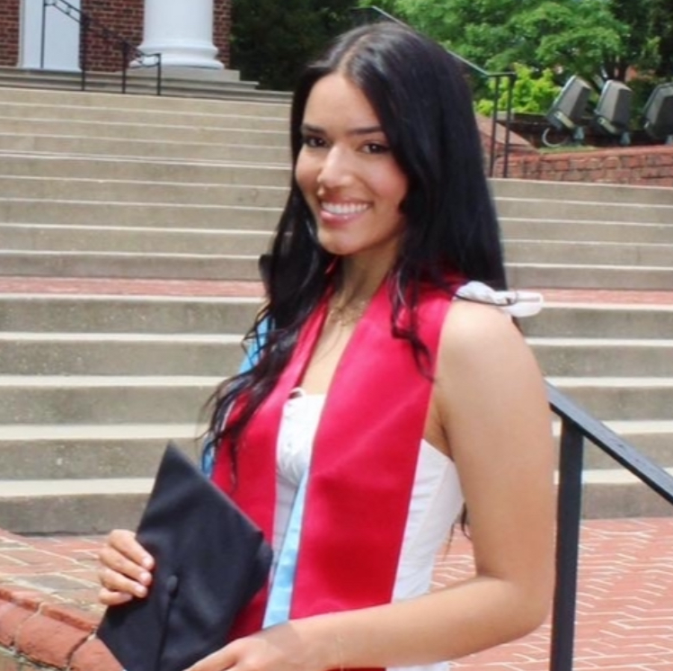

I am originally from Maryland, just outside of Washington, DC. Having attended the University of Maryland before moving to NYC, I have lived on the East Coast my whole life. I am searching for career opportunities in epidemiology, biostatistics, and data analysis in cities along the East Coast. 

Outside of school, I love yoga, trying new coffee shops, and going on long walks to explore New York City. I am always open to new cuisines! :) 

